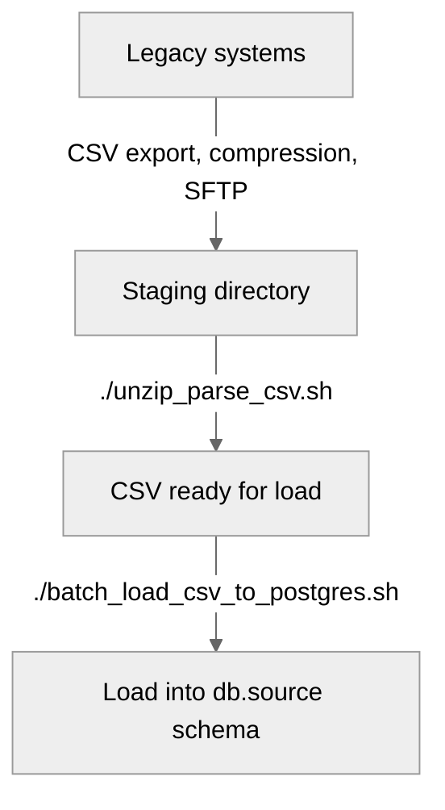

# (DEPRECATED) Scripts for legacy data loading (AIC/SDE)

Bash scripts used to clean and load legacy data (CSV) into Postgres db running in a Docker container.

As part of the London SDE Programme, the London AI Centre is working in NHS Hospital Trusts to perform ELT and standardisation of Electronic Health Record (EHR) data, including into the OMOP Common Data Model. Trusts may hold as much as 20 years of legacy data - either in originating systems, in long term archival storage, or in data warehouses.

## Introduction

A large amount of data in the NHS are found as CSV files, or can only be exported as such from their source systems. Unfortunately, even when following export rules, errors in CSV files are plentiful, and can result in failure to load into databases or quantities of data being lost during the load process. Common errors are:

- Characters that are not part of default encoding (e.g. UTF-8);
- Delimiters, used to separate fields in a row, appearing in the middle of a field, and unquoted. This is often a problem where CSVs contain semi-structured data, or where a user has the option to input free text;
- Newline or Carriage Return found in the middle of fields, causing programs to read a single row as multiple;
- Isolated double quotes found inappropriately in the middle of fields.

With CSV sizes ranging from several million to a billion rows, errors are not possible to correct manually. These scripts are written to clean specific types of error in CSV files, while logging and surfacing faulty rows. They are written for our specific load process, but can be adapted.   

## Infrastructure

Default infrastructure is an on-prem Linux server, part of Nvidia DGX Platforms used by the AI Centre for training, deployment, and federation across multiple sites. The main dev and prod Postgres databases are run from Docker. 

## Pipeline

Load of legacy data follows the below 'one-off' process. Note that 'live' data, and unstructured data, follow different pipelines.



Note that:
- We export CSVs from source systems with UTF-8 encoding, pipe delimiter, and LF for newline;
- Incoming compressed CSVs (.zip) are staged in ```/srv/shared/```;
- CSVs are unzipped into ```/srv/shared/sources``` for load;
- Database connection details should be configured as environmental variables
 
## Usage

1. Set environmental variables, e.g.:
```
$ cp env.example .env 
$ vi .env # Insert settings
$ source .env
```

2. Select compressed CSV file to unzip and parse delimiters/newline/encoding: 
```
$ ./unzip_parse_csv.sh
```

3. Select CSV file to load into Postgres:
```
$ ./load_csv_to_postgres.sh
```

<a href="https://www.aicentre.co.uk/"></a>
